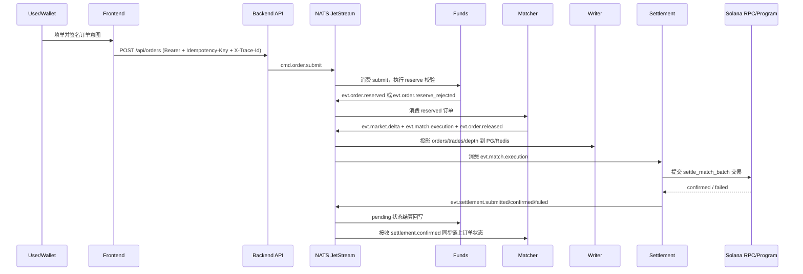

# BlinkPredict

BlinkPredict 是一个基于 Solana 的预测市场系统，采用前后端分离 + 事件驱动后端 + Anchor 合约的架构。  
当前代码形态是单仓多模块（`Frontened` / `Banckend` / `Contract`），重点覆盖从下单、资金预占用、撮合、链上结算到读模型投影的主链路。

## 仓库结构

```text
.
├── Banckend/   # Go API + NATS JetStream workers + PG/Redis projector
├── Frontened/  # Next.js 16 + React 19 交易前端
├── Contract/   # Solana Anchor Program (Rust)
└── spec/       # 架构设计与分阶段交付文档
```

## 系统总架构

```mermaid
flowchart LR
  U["User + Solana Wallet"]

  subgraph FE["Frontened (Next.js)"]
    UI["Trading UI / Wallet Adapter"]
    META["/api/market-metadata"]
  end

  subgraph BE["Banckend (Go)"]
    API["HTTP Gateway (chi)"]
    AUTH["Wallet Challenge Auth"]
    HUB["WebSocket Hub"]
    CMD["Command Publisher"]

    subgraph BUS["NATS"]
      JS["JetStream (AP_CMD/AP_EVT/AP_WHK)"]
      CORE["Core NATS hot fan-out"]
    end

    FUNDS["Funds Service"]
    MATCHER["Matcher (Market Actors)"]
    WRITER["Writer (PG/Redis 投影)"]
    PUSHER["Pusher Service"]
    SETTLE["Settlement Service"]
    CFM["Confirm Workers (deposit/withdraw/market)"]
    MPJ["Market Projector"]
  end

  PG[("PostgreSQL")]
  REDIS[("Redis")]
  RPC["Solana RPC / WS"]
  PROG["Predix Anchor Program"]
  SPL["SPL Token Accounts (vUSDC / Vault)"]
  IPFS["IPFS Gateway"]
  HERMES["Pyth Hermes API"]

  U --> UI
  UI -->|REST /api| API
  UI -->|WS /ws/markets/{id}| HUB
  UI -->|签名 message/tx| U
  UI -->|校验 feed id| HERMES
  UI --> META
  META -->|ipfs:// -> https://ipfs.io/ipfs/...| IPFS

  API --> AUTH
  API --> CMD
  CMD --> JS
  JS --> FUNDS
  FUNDS -->|evt.order.reserved / rejected| JS
  JS --> MATCHER

  MATCHER -->|evt.market.delta| JS
  MATCHER -->|hot.market.delta| CORE
  CORE --> PUSHER
  PUSHER --> HUB

  MATCHER -->|evt.match.execution| JS
  JS --> SETTLE
  SETTLE -->|submit + confirm| RPC
  RPC --> PROG
  PROG --> SPL
  SETTLE -->|evt.settlement.*| JS
  JS --> FUNDS
  JS --> MATCHER

  JS --> WRITER
  WRITER --> PG
  WRITER --> REDIS
  API --> PG
  API --> REDIS

  JS --> CFM
  CFM --> RPC
  CFM -->|evt.deposit/withdraw/market.*| JS
  JS --> FUNDS
  JS --> MPJ
  MPJ --> PG
  MPJ --> REDIS
```

## 下单到结算时序（核心热路径）



## 关键模块职责

| 模块 | 主要职责 | 关键依赖 |
|---|---|---|
| `Frontened` | 市场展示、下单、钱包登录、行情 WS 订阅 | Next.js, wallet-adapter, zustand |
| `Banckend/internal/http` | 鉴权、验签、幂等与 trace 入口、命令发布 | chi, auth, protocol |
| `Banckend/internal/funds` | 钱包级资金状态机（available/locked/pending） | NATS, PG recovery, Redis projector |
| `Banckend/internal/matching` | 市场级 actor 撮合、批处理输出 | NATS Pull Consumer |
| `Banckend/internal/settlement` | 匹配批次上链、确认与重试、事件回放 | Solana RPC/WS, tx estimator |
| `Banckend/internal/writer` | 交易/盘口/订单状态投影到 PG + Redis | PG, Redis |
| `Banckend/internal/pusher` | 实时市场 delta 广播到 WebSocket 客户端 | Core NATS, websocket hub |
| `Banckend/internal/*confirm` | deposit/withdraw/market 创建确认 worker | Solana confirm waiter |
| `Contract/predix-program` | 链上账户模型与 `settle_match_batch` 结算逻辑 | Anchor, SPL Token, pyth-sdk-solana |

## 外部系统与集成点

- **Solana RPC/WS**：交易提交、签名确认、链上状态查询。
- **NATS JetStream**：命令/事件持久化总线（`AP_CMD`/`AP_EVT`/`AP_WHK`）。
- **Core NATS**：低延迟热广播（`hot.market.delta.*`）。
- **PostgreSQL**：市场、订单、交易、账户与恢复状态持久化。
- **Redis**：高频查询读模型与快速缓存。
- **IPFS**：市场 metadata（CID）存储与展示（前端/后端均支持 `ipfs://` 归一化）。
- **Pyth Hermes**：前端创建 Oracle 市场时的 feed id 与价格数据校验。
- **Helius/Alchemy Webhook（可选）**：代码预留了 webhook 处理器能力，默认流程由 confirm workers 主导。

## 合约侧当前主要指令（代码现状）

`Contract/programs/predix-program/src/lib.rs` 当前包含：

- `initialize_config`
- `create_market`
- `init_user_position`
- `init_user_ledger`
- `deposit`
- `withdraw`
- `settle_match_batch`
- `close_empty_user_position`
- `close_empty_order_state`
- `close_user_ledger`
- `close_resolved_market`

## 快速启动（本地开发）

### 1) 后端

```bash
cd Banckend
cp .env.example .env
go run ./cmd/api
```

### 2) 前端

```bash
cd Frontened
cp .env.example .env.local
npm install
npm run dev
```

### 3) 合约（可选）

```bash
cd Contract
yarn install
anchor test
```

## 当前实现边界说明

- `/api/orders/split`、`/api/orders/merge`、`/api/claims` 仍是过渡实现（包含占位逻辑/接口保留）。
- 管理端 oracle resolve 接口已预留，完整链上闭环可继续在此基础扩展。
- 架构上已完成事件驱动主链路，后续可继续推进多实例高可用、consumer 迁移和链上策略增强。
