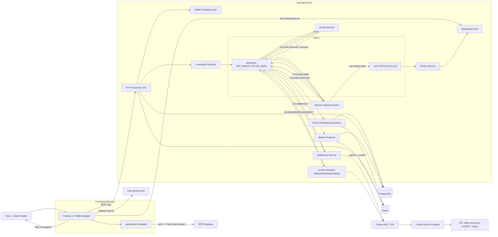
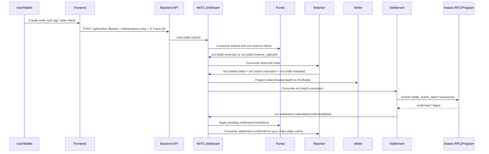

# BlinkPredict

BlinkPredict is a Solana-based prediction market system with a separated frontend/backend architecture, an event-driven backend pipeline, and an Anchor smart contract.
The repository currently uses a multi-module monorepo layout (`Frontened` / `Banckend` / `Contract`) and focuses on the core path from order submission to reserve, matching, on-chain settlement, and read-model projection.

## Repository Layout

```text
.
├── Banckend/   # Go API + NATS JetStream workers + PG/Redis projector
├── Frontened/  # Next.js 16 + React 19 trading frontend
├── Contract/   # Solana Anchor Program (Rust)
└── spec/       # Architecture and phased delivery docs
```

## System Architecture



## Core Order-to-Settlement Sequence



## Module Responsibilities

| Module | Responsibility | Key Dependencies |
|---|---|---|
| `Frontened` | Market UI, order placement, wallet login, market WS subscription | Next.js, wallet-adapter, zustand |
| `Banckend/internal/http` | Auth, signature validation, idempotent/traced command ingress | chi, auth, protocol |
| `Banckend/internal/funds` | Wallet-level funds state machine (`available/locked/pending`) | NATS, PG recovery, Redis projector |
| `Banckend/internal/matching` | Market-level actor matching and batch output | NATS Pull Consumer |
| `Banckend/internal/settlement` | On-chain settlement submit/confirm/retry and recovery | Solana RPC/WS, tx estimator |
| `Banckend/internal/writer` | Projection of orders/trades/depth into PG + Redis | PG, Redis |
| `Banckend/internal/pusher` | Real-time market delta fanout to WS clients | Core NATS, websocket hub |
| `Banckend/internal/*confirm` | deposit/withdraw/market confirm workers | Solana confirm waiter |
| `Contract/predix-program` | On-chain account model and `settle_match_batch` execution logic | Anchor, SPL Token, pyth-sdk-solana |

## External Integrations

- **Solana RPC/WS**: transaction submit, signature confirmation, and chain-state reads.
- **NATS JetStream**: durable command/event bus (`AP_CMD` / `AP_EVT` / `AP_WHK`).
- **Core NATS**: low-latency hot stream fanout (`hot.market.delta.*`).
- **PostgreSQL**: markets, orders, trades, accounts, and recovery-state persistence.
- **Redis**: high-frequency query read models and cache.
- **IPFS**: market metadata (CID) storage and retrieval (`ipfs://` normalization supported on both backend and frontend).
- **Pyth Hermes**: frontend feed-id and price validation for oracle-mode market creation.
- **Helius/Alchemy Webhook (optional)**: webhook handlers exist in code; default flow is currently confirm-worker driven.

## Contract Instructions (Current Codebase)

`Contract/programs/predix-program/src/lib.rs` currently includes:

- `initialize_config`
- `create_market`
- `init_user_position`
- `init_user_ledger`
- `deposit`
- `withdraw`
- `settle_match_batch`
- `close_empty_user_position`
- `close_empty_order_state`
- `close_user_ledger`
- `close_resolved_market`

## Quick Start (Local Development)

### 1) Backend

```bash
cd Banckend
cp .env.example .env
go run ./cmd/api
```

### 2) Frontend

```bash
cd Frontened
cp .env.example .env.local
npm install
npm run dev
```

### 3) Contract (Optional)

```bash
cd Contract
yarn install
anchor test
```

## Current Implementation Boundaries

- `/api/orders/split`, `/api/orders/merge`, and `/api/claims` are still transitional endpoints (partially scaffolded / placeholder behavior).
- Admin oracle resolve endpoints are reserved; full production-grade on-chain resolve automation can be extended from the current base.
- The event-driven core path is in place; next steps are multi-instance HA, full consumer migration cleanup, and additional on-chain policy hardening.
