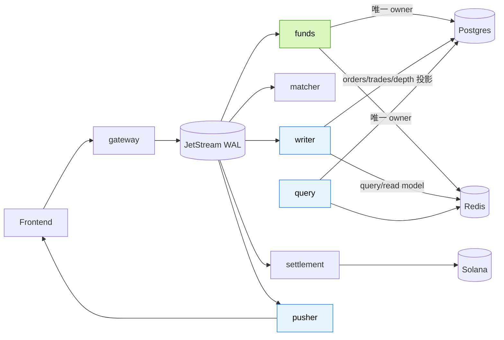
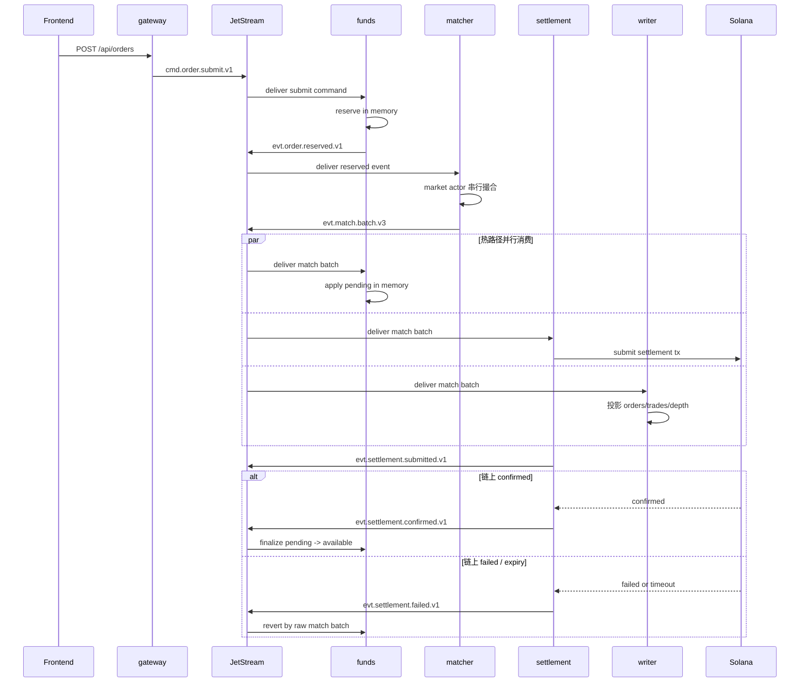
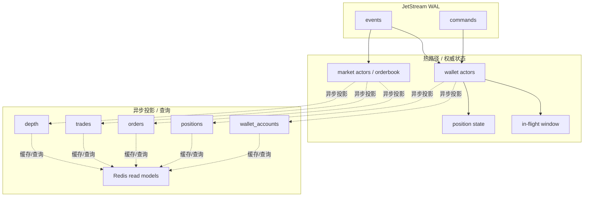
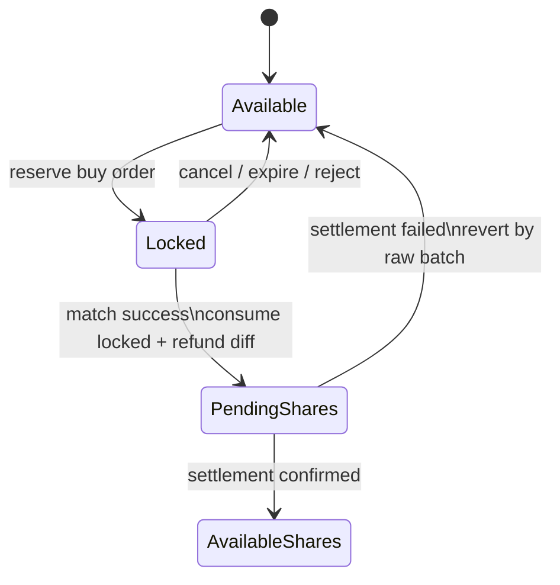
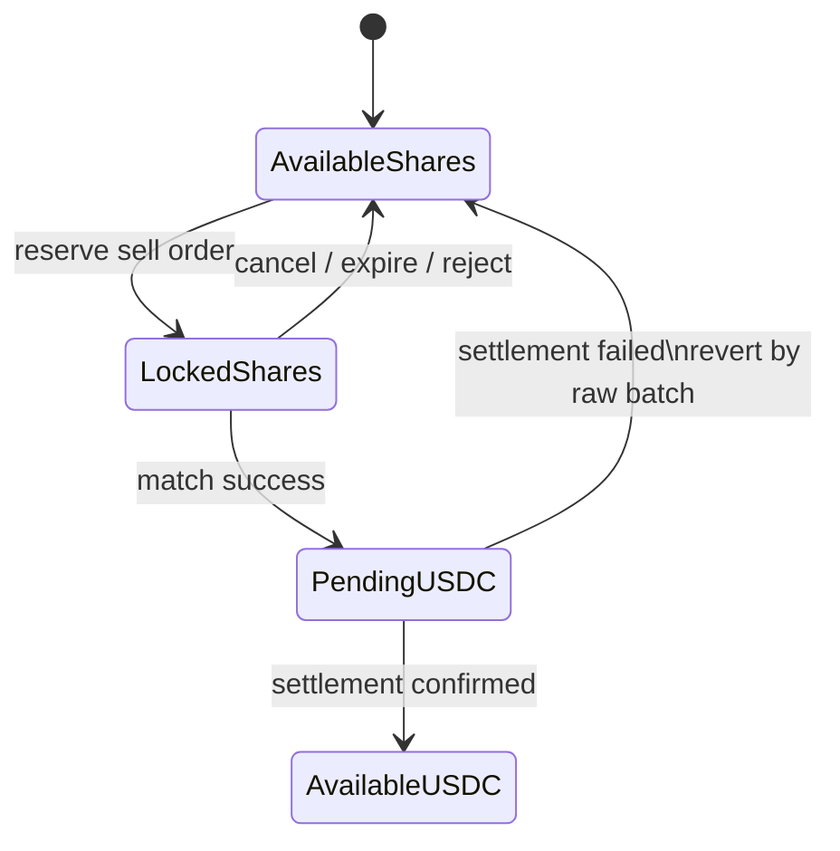
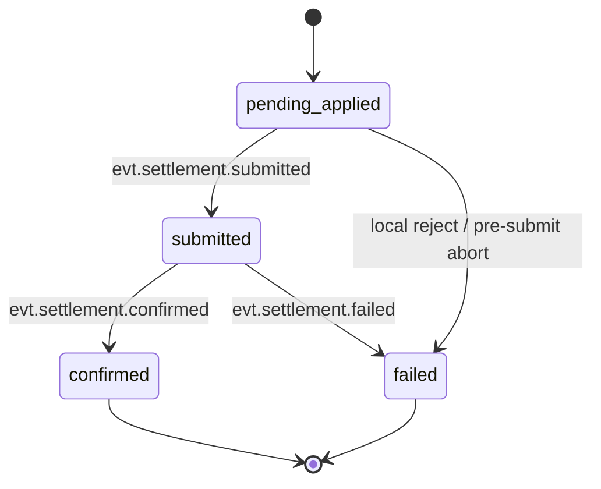
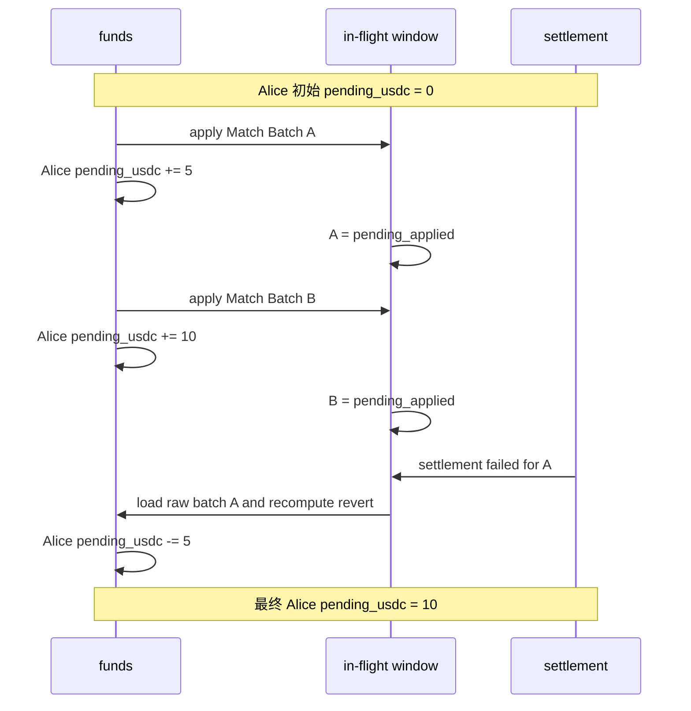
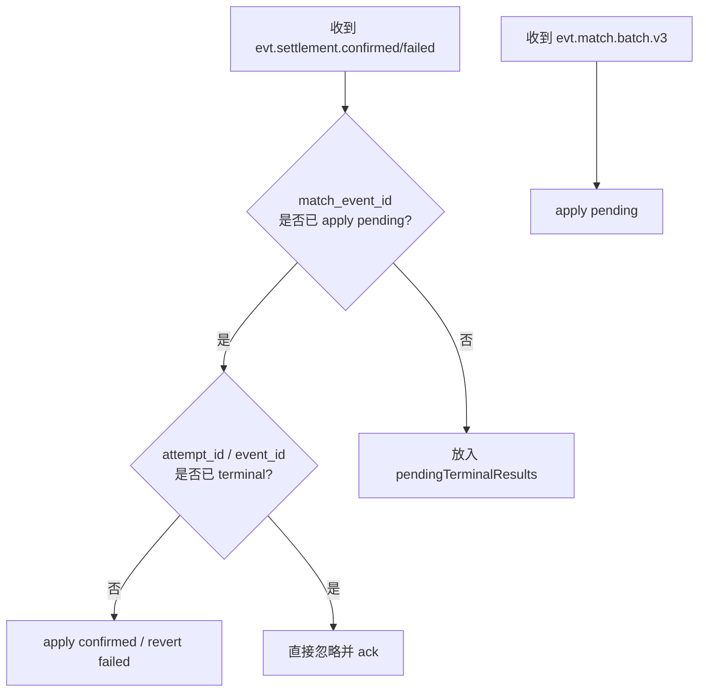
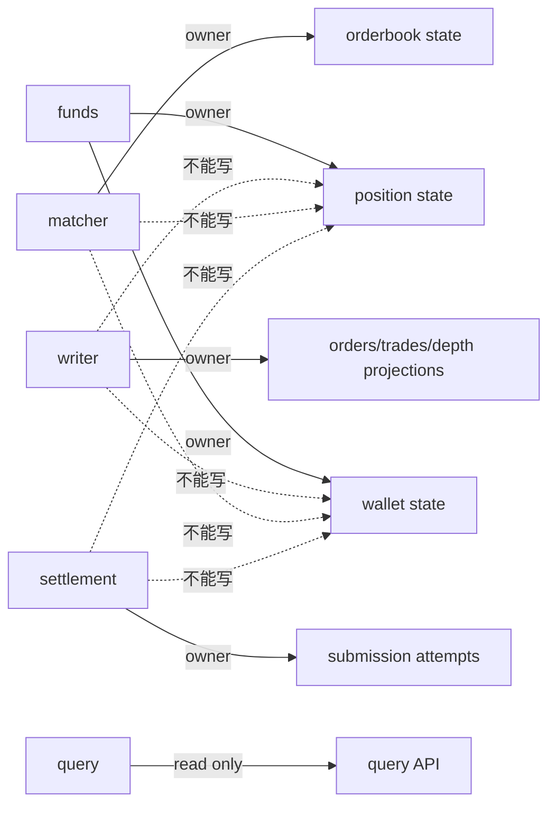

# 高 TPS 热路径重构：JetStream WAL + In-Flight Window

## 1. 文档目的

本文件用于补充并修正 [`spec/new/0-redesignproduct.md`](/Users/guohaochuan/Documents/web3project/BlinkPredict/spec/new/0-redesignproduct.md) 中关于 `funds / matcher / settlement / writer` 的热路径、失败回滚、乱序处理、重复投递处理、重启恢复的设计假设。

本文件明确采用以下原则：

1. 撮合热路径不引入 Postgres / Redis 读写。
2. JetStream 是热路径的 **唯一 WAL（Write-Ahead Log）**。
3. 失败回滚不依赖聚合态 `pending_*` 反推，不落库保存每个 wallet 的 delta 小票。
4. 失败回滚与成功转正都基于 **原始 match batch 数据重新计算**。
5. `matcher` 不维护资金账本。
6. `funds` 是钱包与仓位状态的唯一 owner。
7. `writer/query/redis` 只做异步投影与查询，不参与热路径判定。

---

## 2. 先明确几个核心结论

### 2.1 什么不能做

以下做法本轮明确禁止：

1. `funds` 在 reserve / match / settlement 热路径里同步写 Postgres。
2. `funds` 在热路径里同步写 Redis 作为成功前提。
3. `failed` 时看当前 `pending_usdc = 15`，然后“猜”应该回滚多少。
4. `writer` 和 `funds` 同时写 `positions / wallet_accounts`。
5. `settlement` 只发 `confirmed`，不发 `failed`。
6. 用多个彼此独立的 NATS consumer 分别消费 `match`、`confirmed`、`failed`，却假定这些消息天然有序。

### 2.2 什么必须做

1. 用 JetStream 保存所有权威热路径事件。
2. `funds` 内存中维护：
   - 钱包总账
   - 仓位总账
   - in-flight 窗口
3. `settlement` 内存中维护：
   - submission attempt 状态
   - blockhash / last valid block height
4. `confirmed / failed` 到达时，按 `match_event_id` 找原始 batch，重新计算并 apply / revert。
5. 模块重启后先恢复 snapshot，再从 JetStream replay 到最新 sequence。

---

## 3. 模块职责重新划分

### 3.1 `gateway`

职责：

1. HTTP 接口接入。
2. 鉴权、签名校验、基本字段校验。
3. 生成 command 并发到 JetStream。

不负责：

1. 钱包余额冻结。
2. 仓位冻结。
3. 订单簿写入。
4. settlement 状态。

### 3.2 `funds`

职责：

1. 维护钱包级内存状态：
   - `available_usdc`
   - `locked_usdc`
   - `pending_usdc`
2. 维护市场级仓位内存状态：
   - `available_yes/no`
   - `locked_yes/no`
   - `pending_yes/no`
3. 处理：
   - reserve
   - release
   - match pending
   - settlement confirmed
   - settlement failed
4. 维护 in-flight 窗口。
5. 异步把状态投影到 `wallet_accounts / positions / Redis`。

不负责：

1. 订单簿撮合。
2. 链上交易提交。
3. `orders / trades / depth` 投影。

### 3.3 `matcher`

职责：

1. 单市场 orderbook 内存。
2. 市场 actor 串行处理下单输入与撤单输入。
3. 产出 `match batch` 事件。

不负责：

1. 钱包账本。
2. 仓位账本。
3. settlement 成功 / 失败后的资金转正或回滚。

### 3.4 `settlement`

职责：

1. 消费 `match batch`。
2. 构造并提交链上交易。
3. 跟踪链上状态。
4. 发：
   - `submitted`
   - `confirmed`
   - `failed`

不负责：

1. 修改钱包总账。
2. 修改仓位总账。

### 3.5 `writer`

职责：

1. 异步消费 WAL 事件。
2. 更新：
   - `orders`
   - `trades`
   - `depth`
   - query 读模型
3. 推送 websocket / pusher 事件。

不负责：

1. 维护权威钱包状态。
2. 维护权威仓位状态。
3. 做 settlement 转正。

---

## 4. NATS / JetStream 主题重构

本轮使用两类消息面：

1. **JetStream 权威 WAL**
2. **Core NATS / WS 低延迟广播**

所有影响真实状态的消息必须进入 JetStream。

### 4.1 Command Stream：`AP_CMD`

#### `cmd.order.submit.v1`

- producer: `gateway`
- consumer: `funds`
- 作用：请求 reserve

#### `cmd.order.cancel.submit.v1`

- producer: `gateway`
- consumer: `matcher`
- 作用：请求取消挂单
- 说明：取消的胜负必须由市场 actor 决定，不能先由 funds 释放资产

#### `cmd.tx.confirm.deposit.v1`

- producer: `gateway`
- consumer: `depositconfirm`

#### `cmd.tx.confirm.market_create.v1`

- producer: `gateway`
- consumer: `marketconfirm`

### 4.2 Event Stream：`AP_EVT`

#### `evt.order.reserved.v1.{market_id}`

- producer: `funds`
- consumer: `matcher`
- 含义：reserve 成功，允许进入 orderbook

#### `evt.order.reserve_rejected.v1.{market_id}`

- producer: `funds`
- consumer: `writer / pusher`
- 含义：reserve 失败

#### `evt.order.released.v1.{market_id}`

- producer: `matcher`
- consumer: `funds / writer / pusher`
- 含义：撤单、过期、拒绝后释放剩余冻结资产

#### `evt.match.batch.v3.{market_id}`

- producer: `matcher`
- consumer: `funds / settlement / writer / pusher`
- 含义：撮合结果权威输入
- 要求：
  - 必须包含 `match_event_id`
  - 必须包含完整 `orders` 快照
  - 必须包含完整 `fills`
  - 必须包含 `order_updates`
  - 必须能独立重算这次 batch 对资金与仓位的影响

#### `evt.settlement.submitted.v1.{market_id}`

- producer: `settlement`
- consumer: `funds / writer / pusher / recovery`
- 含义：某个 `match_event_id` 已提交链上
- 必带字段：
  - `attempt_id`
  - `match_event_id`
  - `tx_signature`
  - `recent_blockhash`
  - `last_valid_block_height`
  - `wallets`

#### `evt.settlement.confirmed.v1.{market_id}`

- producer: `settlement`
- consumer: `funds / writer / pusher`
- 含义：某个 attempt 已链上确认
- 必带字段：
  - `attempt_id`
  - `match_event_id`
  - `tx_signature`
  - `wallets`

#### `evt.settlement.failed.v1.{market_id}`

- producer: `settlement`
- consumer: `funds / writer / pusher`
- 含义：某个 attempt 已明确失败
- 必带字段：
  - `attempt_id`
  - `match_event_id`
  - `tx_signature`
  - `reason`
  - `wallets`

#### `evt.deposit.confirmed.v1`

- producer: `depositconfirm`
- consumer: `funds / writer`

#### `evt.deposit.failed.v1`

- producer: `depositconfirm`
- consumer: `writer / pusher`

### 4.3 Core NATS / WS 广播

以下不是权威状态，仅用于低延迟前端刷新：

1. depth delta
2. trade executed push
3. user order updated push
4. wallet snapshot push
5. position snapshot push

丢失后通过 query 重建，不参与风控与热路径恢复。

---

## 5. Hot Path 的真实执行链路

## 5.1 下单阶段：`gateway -> funds`

1. 前端请求 `POST /api/orders`
2. `gateway` 做：
   - wallet 鉴权
   - 原始参数校验
   - 原始签名校验
   - 归一化出 matcher 语义
3. `gateway` 发布 `cmd.order.submit.v1`
4. `funds` 的 submit consumer 收到命令
5. `funds` 把命令按 `wallet_address` 路由到对应 wallet actor
6. wallet actor 在纯内存中执行 reserve：
   - 买单：`available_usdc -> locked_usdc`
   - 卖 yes：`available_yes -> locked_yes`
   - 卖 no：`available_no -> locked_no`
7. reserve 成功后，`funds` 发布 `evt.order.reserved.v1.{market_id}`
8. reserve 失败则发布 `evt.order.reserve_rejected.v1.{market_id}`
9. Postgres / Redis 投影在异步 projector 中更新，不阻塞 1~8

**关键点**

1. reserve 是钱包级 / 仓位级的热状态判断，必须只看 `funds` 内存。
2. query 表和 Redis 只是异步副本，不参与准入裁决。

---

## 5.2 撮合阶段：`funds -> matcher`

1. `matcher` 只消费 `evt.order.reserved.v1.{market_id}` 与 `cmd.order.cancel.submit.v1`
2. 所有同一个 `market_id` 的输入进入同一个 market actor
3. actor 串行处理：
   - 新挂单
   - 撮合
   - 撤单
   - 过期扫单
4. 处理后产出一个 `evt.match.batch.v3.{market_id}`

### 5.2.1 为什么撤单必须进 matcher actor

因为“用户点撤单时恰好成交”这种竞态，只能由 orderbook owner 决定：

1. 如果 cancel 先进入 actor：
   - 订单先出 book
   - 后续撮合看不到这张单
2. 如果 fill 先进入 actor：
   - 订单已成交
   - cancel 只能拿到 rejected / no-op

这个胜负不能由 `funds` 猜，也不能由前端猜。

---

## 5.3 挂单释放阶段：`matcher -> funds`

当订单被取消、过期、拒绝，或者一笔 order update 释放了剩余冻结资产时：

1. `matcher` 发布 `evt.order.released.v1.{market_id}`
2. `funds` 按 `wallet_address` 路由到对应 wallet actor
3. wallet actor 执行 release：
   - 买单：`locked_usdc -> available_usdc`
   - 卖 yes：`locked_yes -> available_yes`
   - 卖 no：`locked_no -> available_no`

这样做的好处是：

1. 资产释放与撮合胜负分离
2. 释放动作以 matcher 的最终 orderbook 事实为准

---

## 5.4 撮合后 pending 阶段：`matcher -> funds`

### 5.4.1 `funds` 如何处理 `evt.match.batch.v3`

1. `funds` 事件 dispatcher 顺序消费 JetStream 事件
2. 收到 `match batch` 后：
   - 先检查 `match_event_id` 是否已处理
   - 已处理则直接 ack
3. 若未处理：
   - 把原始 batch 放入 `recentBatchCache`
   - 对 batch 中涉及的每个 wallet，计算该 wallet 的本次影响
   - 把该 wallet 的子操作投递到对应 wallet actor

### 5.4.2 wallet actor 只做自己的那一半

例如一笔撮合涉及 Alice 与 Bob：

1. dispatcher 从原始 batch 中计算：
   - Alice 的 wallet/position 变化
   - Bob 的 wallet/position 变化
2. 分别投给：
   - `walletActor[Alice]`
   - `walletActor[Bob]`

这样：

1. 不需要全局大锁
2. 不需要 `matcher` 维护资金账本
3. 不需要预先把 per-wallet delta 落库

### 5.4.3 pending 的规则

#### 买单成交

以 `buy yes` 为例：

1. 从 `locked_usdc` 里消费本次成交对应金额
2. 若限价锁定 > 实际成交成本：
   - 差额立刻回 `available_usdc`
3. 新买到的份额进入：
   - `pending_yes`

`buy no` 同理，只是进入 `pending_no`

#### 卖单成交

以 `sell yes` 为例：

1. 从 `locked_yes` 里扣掉本次成交份额
2. 卖出所得进入：
   - `pending_usdc`

`sell no` 同理。

### 5.4.4 这里为什么不看数据库

因为这一层是纯热状态流转：

1. reserve 刚在内存里发生
2. match 刚在内存 book 里发生
3. 继续回头读 Postgres / Redis 只会引入：
   - 网络 RTT
   - 序列化开销
   - 锁竞争
   - query lag 误判

因此这一步必须纯内存完成。

---

## 6. In-Flight Window 设计

## 6.1 为什么需要 In-Flight Window

它不是资金账本，也不是落库的小票表。

它只是 **热内存中的“待决 batch 窗口”**。

作用：

1. 记住哪些 `match_event_id` 已经被 apply 到 `pending`
2. 记住这些 batch 现在对应哪个 `attempt_id`
3. 等待 `confirmed / failed`
4. terminal 后再从窗口移除

### 6.2 数据结构

`funds` 侧：

```text
recentBatchCache[match_event_id] = raw MatchBatchEventV3
inflightState[match_event_id] = {
  market_id,
  wallets,
  phase,              // pending_applied | submitted | confirmed | failed
  attempt_id,
  tx_signature,
  last_valid_block_height,
  applied_evt_seq
}
```

### 6.3 这和“小票表”的区别

本设计不在热路径里把每个 wallet 的 delta 单独落库。

本设计只做两件事：

1. JetStream 里保存原始 match batch 作为 WAL
2. 内存里保存一个小窗口，记住这批现在处于什么阶段

等 `confirmed / failed` 时：

1. 找回 `match_event_id`
2. 取原始 batch
3. 对每个 wallet 重新计算
4. apply 或 revert

这正是“按原始数据回滚”，不是“按聚合态猜”。

---

## 7. Settlement 生命周期

## 7.1 为什么必须有 `submitted`

如果只有：

1. `match batch`
2. `confirmed`
3. `failed`

那系统中间少了一层：

- 这笔 batch 到底有没有真正提交链上
- tx signature 是多少
- last valid block height 是多少

所以必须增加：

- `evt.settlement.submitted.v1`

### 7.2 `settlement` 的处理流程

1. `settlement` 消费 `evt.match.batch.v3`
2. build tx
3. submit 到 RPC
4. 得到：
   - `tx_signature`
   - `recent_blockhash`
   - `last_valid_block_height`
5. 立刻发布：
   - `evt.settlement.submitted.v1`
6. 后续 watcher 等待：
   - confirmed
   - failed
   - blockhash expiry

### 7.3 blockhash expiry 兜底

如果发生“无声死亡”：

1. RPC 不回 confirmed
2. RPC 也不回 failed
3. websocket 永远等不到

那么 watcher 以 `last_valid_block_height` 为准：

1. 当前链高 > last valid block height
2. 这笔 attempt 仍未 terminal
3. 直接发布：
   - `evt.settlement.failed.v1`

这一步是正式业务逻辑，不是告警辅助逻辑。

---

## 8. 为什么回滚必须按原始 batch 重算

## 8.1 Alice 场景

Alice 在系统里先后有两笔卖出：

1. Batch A：`pending_usdc +5`
2. Batch B：`pending_usdc +10`

于是当前总账：

```text
pending_usdc = 15
```

这时如果 Batch A 失败：

错误做法：

1. 看总账是 15
2. 从 15 里“猜”回滚多少

正确做法：

1. `evt.settlement.failed` 带上 `match_event_id = A`
2. `funds` 找到 `recentBatchCache[A]`
3. 重新算出：
   - 这批对 Alice 的影响是 `pending_usdc +5`
4. 执行反向操作：
   - `pending_usdc -5`

结果：

```text
15 -> 10
```

Batch B 不受影响。

### 8.2 买单为什么也必须按 batch 重算

例如：

1. Bob 限价买 yes，先锁 `57`
2. 实际成交只花 `54`
3. 撮合时已经发生：
   - `locked_usdc -57`
   - `available_usdc +3`
   - `pending_yes +1`

如果 settlement 最终失败：

你不能只“回滚 54”

你还必须知道：

1. 那个 `+3` refund 之前已经释放过了
2. `pending_yes +1` 要撤掉
3. 这张 order 剩余部分是否仍继续挂单，由 matcher 的 order 状态决定

所以回滚必须以原始 batch 为输入，统一重算。

---

## 9. 乱序处理原则

## 9.1 当前问题

当前代码里：

1. `funds` 有多个 consumer
2. `writer` 也有多个 consumer
3. `match` 和 `settlement confirmed` 走不同订阅路径

这会导致：

1. `confirmed` 先到
2. `match pending` 还没 apply
3. 直接做转正就错

### 9.2 新原则

对于 `funds`：

1. 所有会改资金/仓位状态的 JetStream 事件都必须先经过一个 **统一 dispatcher**
2. dispatcher 以 JetStream sequence 顺序读取
3. dispatcher 再把子任务投给 wallet actors

因此：

1. stream 序在前的 `match batch` 一定先进入 dispatcher
2. stream 序在后的 `confirmed / failed` 一定后进入 dispatcher

如果极端情况下 terminal 事件先到，但对应 `match_event_id` 还未进入 in-flight：

1. 不执行状态变更
2. 放入 `pendingTerminalResults`
3. 等对应 `match batch` apply 完后再补执行

这样不依赖“不同 subject 天然有序”。

---

## 10. 至少一次投递下的幂等

## 10.1 不允许只靠进程内 seen map

进程内 seen map 只能防：

1. 单进程运行期间的重复消息

防不了：

1. 重启后重复
2. consumer rebalance
3. leader 切换重投

### 10.2 新幂等规则

#### 对 `match batch`

每个 `match_event_id` 只能经历：

```text
new -> pending_applied
```

重复到达：

1. 若已是 `pending_applied`
2. 直接忽略并 ack

#### 对 `settlement submitted`

每个 `attempt_id` 只能经历：

```text
new -> submitted
```

重复到达直接忽略。

#### 对 `settlement confirmed / failed`

同一 `match_event_id` / `attempt_id` 只能从：

```text
submitted -> confirmed
submitted -> failed
```

不允许：

```text
confirmed -> confirmed
failed -> failed
confirmed -> failed
failed -> confirmed
```

出现冲突直接告警并拒绝再次 apply。

### 10.3 幂等状态放在哪里

幂等状态属于：

1. `funds` 的 in-flight 窗口
2. `settlement` 的 attempt 状态机

它们最终进入 snapshot / replay 恢复，不依赖 DB 热写。

---

## 11. 重启恢复

## 11.1 核心原则

重启恢复不能依赖：

1. Postgres 当前是不是刚好跟上了热状态
2. Redis 当前是不是刚好没丢

因为它们只是异步投影。

真正的恢复基线必须是：

1. **snapshot**
2. **JetStream WAL replay**

### 11.2 `matcher` 恢复

`matcher` 维护：

1. market orderbook snapshot
2. last applied sequence checkpoint

重启时：

1. 先加载最近 snapshot
2. 再从 JetStream replay：
   - `evt.order.reserved`
   - `cmd.order.cancel.submit`
3. 回放到最新 sequence
4. 再对外开放写流量

### 11.3 `funds` 恢复

`funds` 维护：

1. wallet actor snapshot
2. in-flight window snapshot
3. last applied command/event sequence

重启时：

1. 先加载最近 snapshot
2. replay：
   - `cmd.order.submit.v1`
   - `evt.order.released.v1`
   - `evt.match.batch.v3`
   - `evt.settlement.submitted.v1`
   - `evt.settlement.confirmed.v1`
   - `evt.settlement.failed.v1`
   - `evt.deposit.confirmed.v1`
3. 重建：
   - 钱包总账
   - 仓位总账
   - in-flight window
   - terminal 状态
4. 回放完成后才开放写流量

### 11.4 `settlement` 恢复

`settlement` 维护：

1. pending attempt snapshot
2. last applied sequence

重启时：

1. 加载 snapshot
2. replay `evt.match.batch.v3`
3. 恢复未 terminal 的 attempt
4. 对这些 attempt 做 reconcile：
   - 已 confirmed -> 发 confirmed
   - 已过期 -> 发 failed
   - 仍有效 -> 继续 watcher

---

## 12. Snapshot / Checkpoint 设计

### 12.1 允许异步，不在热路径阻塞

snapshot / checkpoint 可以：

1. 每 N 条事件异步落一次
2. 每 T 秒异步落一次
3. 在后台单独线程执行

但不能：

1. 每次 reserve 都同步 fsync
2. 每次 match 都同步写数据库

### 12.2 存储位置

本轮建议：

1. JetStream 负责 WAL
2. snapshot/checkpoint 先采用本地文件或本地持久卷
3. 后续拆服务时再迁移到对象存储 / 分布式卷

本轮不要求 snapshot 进入 Postgres。

---

## 13. Query / Redis / Writer 的边界

### 13.1 只做异步投影

以下状态只由 projector 从 WAL 异步更新：

1. `wallet_accounts`
2. `positions`
3. `orders`
4. `trades`
5. `depth`
6. Redis key

### 13.2 UI 看到的数据可能短暂落后

这是接受的设计取舍。

原因：

1. 风控与热路径正确性比 UI 秒级完全同步更重要
2. UI 可通过 websocket 增量补齐感知
3. 页面冷启动可先读 query snapshot，再接 websocket

### 13.3 但“正确性真相”只能来自热内存 + WAL

不能反过来让：

1. gateway 依赖 Redis 决策
2. matcher 依赖 Postgres 恢复热状态而不 replay
3. settlement 依赖 query 表判断 pending

---

## 14. 本轮开发边界

## 14.1 本轮必须完成

1. `funds` 成为 `wallet + position` 唯一 owner
2. `writer` 停止写 `wallet_accounts / positions`
3. `evt.match.batch.v3` 成为权威撮合输出
4. `settlement` 增加：
   - `submitted`
   - `confirmed`
   - `failed`
5. `settlement` 增加 blockhash expiry watchdog
6. `funds` 引入：
   - recent batch cache
   - in-flight window
   - unified dispatcher
   - wallet actor
7. `confirmed / failed` 都按原始 batch 重算 apply/revert
8. `matcher / funds / settlement` 最小 snapshot + replay 恢复

## 14.2 本轮可以后做

1. 跨机房多副本一致性
2. 多实例 active-active matcher
3. 分布式 snapshot 存储
4. 完整运维控制面

---

## 15. 关键收益

采用本方案后：

1. 撮合热路径不再被 DB/Redis 拖慢。
2. 失败回滚不再靠聚合态猜测，而是按原始 batch 精确重算。
3. `confirmed / failed` 重复投递不会重复记账。
4. blockhash 过期不会让资产永久卡在 pending。
5. 重启后能从 snapshot + WAL 精确恢复。
6. `matcher`、`funds`、`settlement` 的 owner 边界清晰。
7. query 与热状态分离，后续拆微服务不需要再推翻主逻辑。

---

## 16. 一句话总结

新方案的核心不是“把更多数据写进数据库”，而是：

1. **JetStream 记录所有权威事件**
2. **热状态只在内存 actor 中推进**
3. **失败时按原始 batch 重算，而不是按聚合态反推**
4. **查询与恢复分离，热路径与投影分离**

这才符合：

1. 高 TPS
2. 少锁
3. 少停顿
4. 可回滚
5. 可恢复

---

## 17. Mermaid 架构图

下面几张图分别从：

1. 模块职责
2. 主事件链路
3. 资金状态流转
4. 异常与恢复

四个角度表达整体架构。

### 17.1 模块职责总览



### 17.2 NATS / JetStream 主链路



### 17.3 热状态与异步投影分层



### 17.4 资金状态流转：买单



补充解释：

1. `Available -> Locked` 发生在 `funds reserve`
2. `Locked -> PendingShares` 发生在 `funds apply match batch`
3. `PendingShares -> AvailableShares` 发生在 `settlement confirmed`
4. `PendingShares -> Available` 发生在 `settlement failed`

### 17.5 资金状态流转：卖单



### 17.6 In-Flight Window 语义



这张图强调：

1. in-flight window 不是账本，只是 batch 生命周期窗口
2. 真正的 apply / revert 依据是 `match_event_id -> raw match batch`

### 17.7 Alice 并发批次示意图



这张图表达的重点是：

1. 回滚不看聚合后的 `15`
2. 回滚只根据 `A` 对应的原始 batch 重新计算

### 17.8 乱序与重复消息处理



### 17.9 重启恢复全景图


### 17.10 模块 owner 关系图



这张图是整个方案最重要的一张图：

1. `funds` 是资产 owner
2. `matcher` 是订单簿 owner
3. `settlement` 是链上提交生命周期 owner
4. `writer` 只是投影 owner
