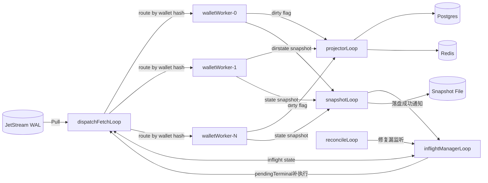
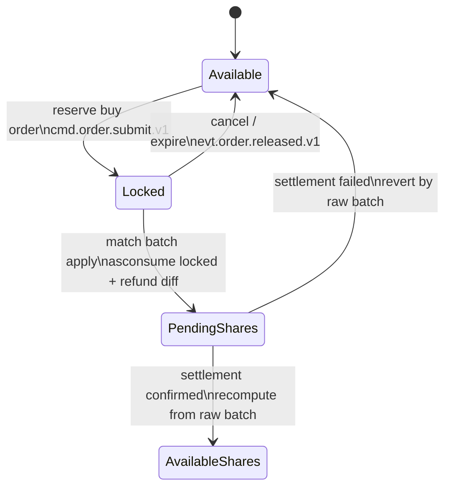
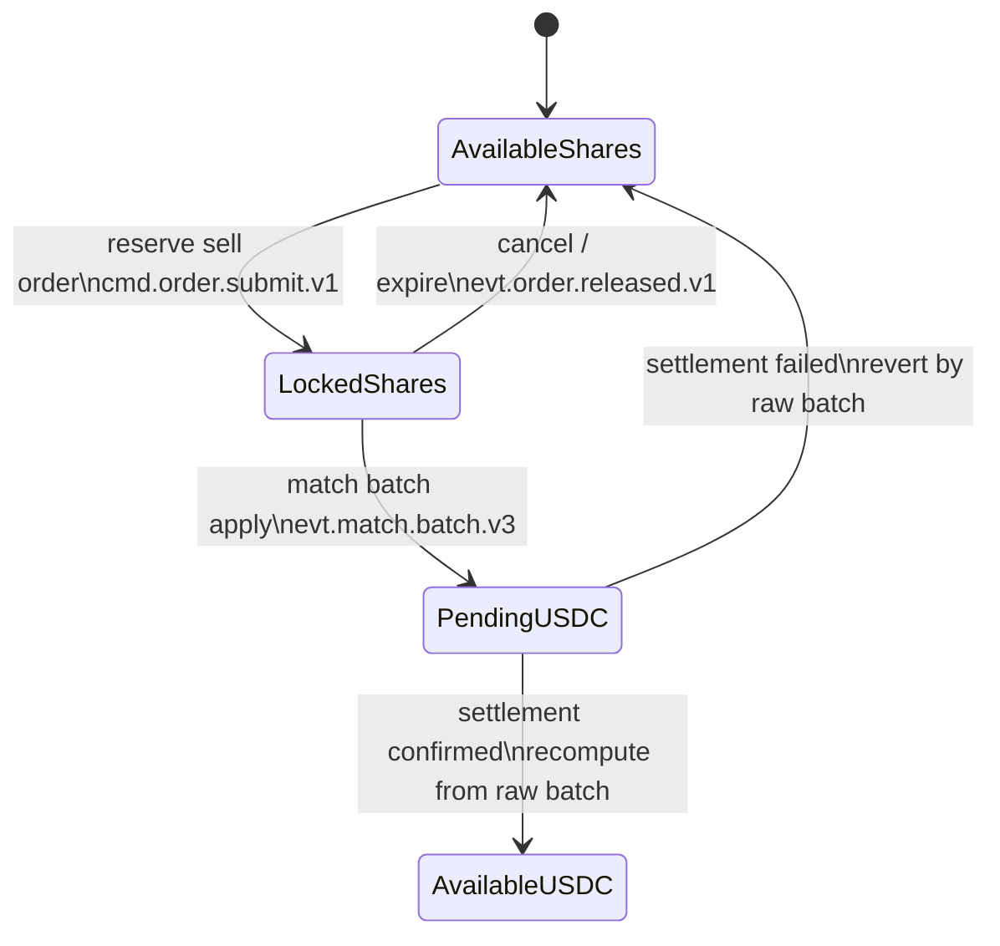
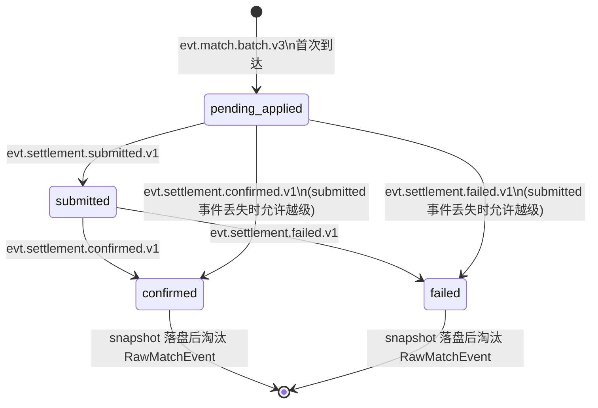
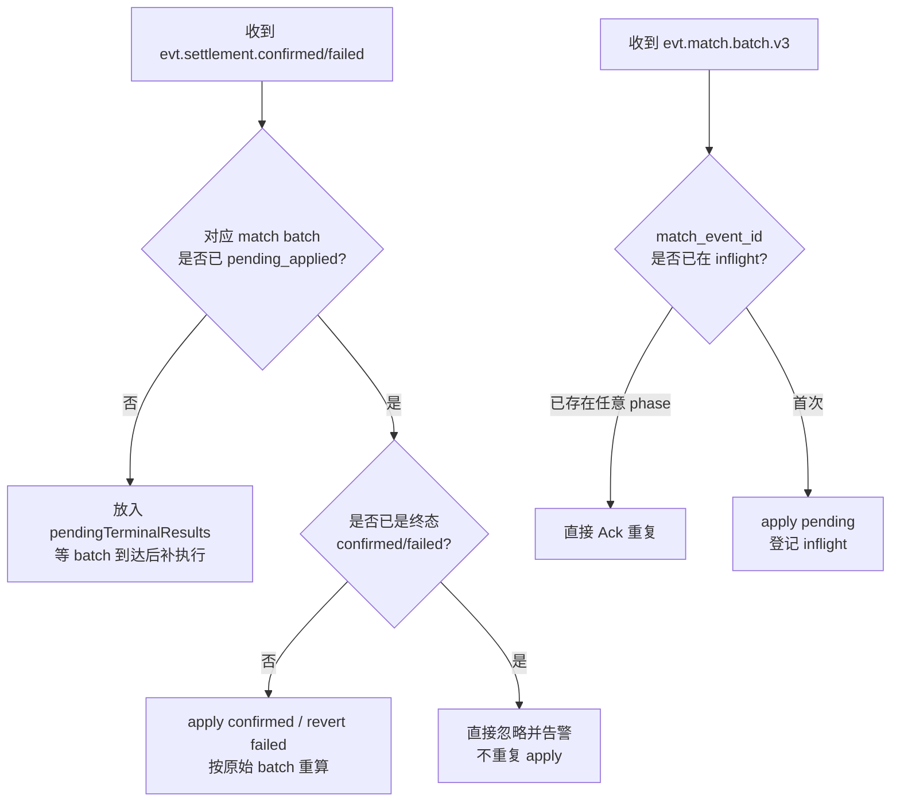
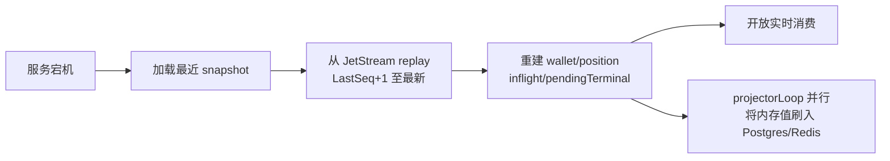

# Funds 开发文档

## 1. 文档目标

本文只解决一件事：

- 把 `funds` 模块收敛成一套可以直接开发的最小方案。

约束前提：

1. 以 `spec/new/2-hotpath-wal-inflight-redesign.md` 和 `spec/new/3-settlement-development.md` 为准。
2. 当前仓库里的 `funds` 代码仍是旧模式，只能作为历史参考，不能反向约束本文。
3. 当前 `settlement` 模块已完成开发，本文必须明确与其事件接口完全对齐。
4. 本文只描述 `funds` 自己必须承担的职责，不重复展开 `matcher / settlement / writer` 的内部实现。

本文重点解决以下六件事：

1. `funds` 到底拥有什么权威状态。
2. `funds` 进程内的最小协程架构。
3. `funds` 如何消费每一类事件，以及每类事件的处理规则。
4. `funds` 如何在乱序、重复投递、重放、重启恢复下保持正确。
5. `funds` 的 snapshot / checkpoint 设计。
6. `funds` 的 Postgres / Redis 异步投影策略。

---

## 2. 最终边界

`funds` 是以下状态的唯一 owner：

1. 钱包资金总账
   - `available_usdc`
   - `locked_usdc`
   - `pending_usdc`
2. 市场仓位总账
   - `available_yes/no`
   - `locked_yes/no`
   - `pending_yes/no`
3. 热内存中的 in-flight 状态
   - 哪些 `match_event_id` 已经做过 `pending apply`
   - 哪些已经收到 `submitted`
   - 哪些已经终态 `confirmed / failed`

`funds` 不负责：

1. orderbook 撮合
2. 链上交易提交与监听
3. `orders / trades / depth` 投影
4. 用 Postgres / Redis 作为热路径准入依据

一句话说，`funds` 只做资产状态机，不做链上状态机，也不做订单簿状态机。

---

## 3. 最小架构

V1 只保留 4 个逻辑角色：

1. `dispatcher`
   - 从 JetStream 顺序读取会修改资金/仓位的权威事件
   - 统一做幂等检查、顺序控制、任务分发
2. `wallet actors`（分片 Worker Pool）
   - 按 `wallet_address` 哈希分片后串行执行单钱包状态变更
   - 不为每个用户动态创建 goroutine，用固定分片池规避 OOM
3. `inflight store`
   - 维护 `match_event_id -> InflightMatch` 的热窗口
   - 保留未终态 batch 的原始数据，供 confirmed/failed 时重算
4. `projector`
   - 以 dirty-flag + 周期微批的方式异步把钱包/仓位快照投影到 Postgres / Redis
   - 不干预热路径判定

V1 不引入：

1. 单独的 per-wallet delta 持久化小票表
2. 多套独立 consumer 分别处理 match / confirmed / failed
3. 依赖 Postgres 反推 pending 回滚量
4. 分布式多实例 funds 协调

`funds` 的开发目标是"事件入口单一、状态推进单一、恢复路径单一"。

---

## 4. 进程内协程划分

V1 采用单进程、多协程、单二进制落地。建议最小协程划分如下：

### 4.1 `dispatchFetchLoop`

- 以 JetStream Pull Consumer 拉取所有权威事件，单次 `Fetch(N=64)`
- 解析 subject 与 schema，按事件类型路由给内部处理函数
- 负责做第一道幂等检查（命中 inflight 状态机）
- 统一控制 Ack / Nak / Term

### 4.2 `walletWorker[N_SHARDS]`

- 启动固定数量的常驻 goroutine（建议 256 或 1024 个分片）
- `wallet_address` 哈希取模后路由到对应 shard 的 channel
- 每个 shard 独立顺序处理本分片内所有 wallet 的账本变更
- 效果：
  - 同一 wallet 的多次操作严格串行，无需锁
  - 不同 wallet 的操作在不同 shard 中并行
  - goroutine 数量上限固定，不随用户量增长

示例路由逻辑：

```go
const N_SHARDS = 256

workerChans [N_SHARDS]chan walletTask

func routeWallet(addr string) chan walletTask {
    h := fnv32a(addr)
    return workerChans[h%N_SHARDS]
}
```

### 4.3 `inflightManagerLoop`

- 全局维护 `inflight map[string]*InflightMatch`
- 维护 `pendingTerminal map[string]*TerminalEvent`（处理乱序时先到的终态）
- 负责状态切换、pending terminal 补执行、告警上报

### 4.4 `snapshotLoop`

- 后台定期（每隔 N 秒或每 M 条事件）触发一次内存快照落盘
- 快照落盘完成后，通知 inflightManagerLoop 清理已终态且已快照的 batch 原始数据
- 快照必须包含：钱包总账、仓位总账、inflight 窗口、last applied seq

### 4.5 `projectorLoop`

- 每隔 500ms ticker 触发一次
- 从各 shard 采集被标记为 dirty 的 wallet/position 实体
- 组装微批 UPSERT 提交到 Postgres
- 同步刷新 Redis 快照

### 4.6 `reconcileLoop`

- 进程启动时做一次全量恢复
- 运行中按 ticker 周期处理：
  - 漏监听的 pending terminal
  - 超时未终态的 in-flight 记录（告警，配合 settlement reconcile）

---

## 5. JetStream 消费配置

`funds` 把内存作为唯一实时真相，Snapshot + JetStream 作为持久化保障。因此 JetStream 策略与传统入库型消费器不同。

### 5.1 Consumer 建议参数

```go
// 所有权威事件统一挂在一个 durable pull consumer 上
// 包含多个不同 subject（下文有详细说明）
FetchBatchSize  = 64
MaxWait         = 1000ms
```

### 5.2 立即 Ack 原则

- `funds` 只要完成以下动作，即可立刻 Ack，**不等 Projector 落盘**：
  1. 内存状态变更完成
  2. Inflight 或账本状态更新完成
  3. `LastAppliedSeq` 更新完成
- 原因：funds 的可靠性基础是 Snapshot + WAL replay，不依赖 DB 入库成功

### 5.3 异常 Ack 策略

| 情况 | Ack 行为 |
|------|----------|
| payload 格式错误 / 缺必要字段 | `Term` — 不重试 |
| 内存状态机处理失败（非预期 panic） | `NakWithDelay` |
| 已处理的重复消息（幂等命中） | 立即 `Ack` |
| 正常处理完毕 | 立即 `Ack` |

### 5.4 消费的 Subject 列表

`funds` 需要消费的所有权威 Subject（按执行顺序）：

```
cmd.order.submit.v1
evt.order.released.v1.{market_id}
evt.match.batch.v3.{market_id}
evt.settlement.submitted.v1.{market_id}
evt.settlement.confirmed.v1.{market_id}
evt.settlement.failed.v1.{market_id}
evt.deposit.confirmed.v1
```

---

## 6. 权威状态模型

### 6.1 钱包总账

```go
type WalletLedger struct {
    AvailableUSDC uint64
    LockedUSDC    uint64
    PendingUSDC   int64
    Dirty         bool // 标记是否需要投影
}
```

语义固定：

1. `available` — 还能继续 reserve 的可用余额
2. `locked` — 已被挂单冻结，但尚未成交完成
3. `pending` — 已被撮合影响，但仍等待 settlement 终态

### 6.2 仓位总账

```go
type MarketPosition struct {
    AvailableYes uint64
    LockedYes    uint64
    PendingYes   int64

    AvailableNo uint64
    LockedNo    uint64
    PendingNo   int64

    Dirty bool // 标记是否需要投影
}
```

### 6.3 In-flight 窗口

这是 `funds` 唯一必须保留的热内存附加状态。

```go
type InflightMatch struct {
    MatchEventID         string
    MarketID             uint64
    MarketPDA            string
    Wallets              []string
    Phase                string   // pending_applied | submitted | confirmed | failed
    LastEventSeq         uint64
    SubmittedTxSignature string
    RawMatchEvent        []byte   // 仅对未终态 inflight 保留原始 batch
}
```

约束：

1. `funds` 不保存 per-wallet delta 持久化小票。
2. `funds` 只保存"这批已经走到哪一步"。
3. 对未终态 inflight，**必须**保留原始 `match batch`（`RawMatchEvent`），供后续 confirmed/failed 精确重算。
4. 真正的 apply / revert 计算都从原始 `evt.match.batch.v3` 重新推导，不根据当前聚合态猜。

这是本文唯一明确接受的"必要冗余"：

1. 不为每个 wallet 持久化 delta；
2. 只为仍未终态的 `match_event_id` 保留原始 batch；
3. 终态记录在完成一次覆盖该终态的 snapshot 后，通知 inflight manager 可以淘汰 `RawMatchEvent`，释放内存。

### 6.4 Pending Terminal 缓冲

```go
type PendingTerminal struct {
    MatchEventID string
    Phase        string // confirmed | failed
    Event        []byte // 原始事件 payload
}

pendingTerminalResults map[string]*PendingTerminal
```

用于处理"terminal 先到，对应 match batch 尚未 apply"的乱序场景。

---

## 7. 事件处理规则

### 7.1 `cmd.order.submit.v1`

#### 前置条件

1. 包含 `command_id`（用于幂等）
2. 包含 `wallet_address`
3. 包含 `order_side`（buy / sell-yes / sell-no）
4. 包含 `price` 和 `quantity`

#### 幂等规则

- 以 `command_id` 幂等
- 若已处理，直接 Ack，不再 reserve

#### 处理流程

1. dispatcher 收到命令
2. 幂等检查：`command_id` 是否已处理
3. 按 `wallet_address` 路由到 wallet shard worker
4. shard worker 只在内存里判断并执行 reserve：
   - 买单：`available_usdc -= price*quantity`，`locked_usdc += price*quantity`
   - 卖 yes：`available_yes -= quantity`，`locked_yes += quantity`
   - 卖 no：`available_no -= quantity`，`locked_no += quantity`
5. reserve 成功：发布 `evt.order.reserved.v1.{market_id}`，设 `Wallet.Dirty=true`
6. reserve 失败（余额不足）：发布 `evt.order.reserve_rejected.v1.{market_id}`
7. dispatcher 立即 Ack，不等 projector

**绝不同步查库判余额。**

### 7.2 `evt.order.released.v1`

#### 前置条件

1. 包含 `wallet_address`
2. 包含 `order_side`
3. 包含释放量 `released_amount`（或 `released_quantity`）

#### 处理流程

1. dispatcher 收到 release 事件
2. 按 wallet 路由到对应 shard worker
3. shard worker 做剩余冻结释放：
   - 买单：`locked_usdc -= released_amount`，`available_usdc += released_amount`
   - 卖 yes：`locked_yes -= released_quantity`，`available_yes += released_quantity`
   - 卖 no：`locked_no -= released_quantity`，`available_no += released_quantity`
4. 设 `Wallet.Dirty=true`
5. dispatcher 立即 Ack

`funds` 不自己判断订单是否该释放，完全接受 `matcher` 的最终结果。

### 7.3 `evt.match.batch.v3`

这是 `funds` 最核心的输入。

#### 前置条件（必须字段）

1. `match_event_id`
2. `market_id`
3. `market_pda`
4. `orders`（参与撮合的订单快照）
5. `fills`（成交详情）
6. 完整的 wallet 影响推导信息（足以独立重算）

#### 幂等规则

- 以 `match_event_id` 幂等
- 若 inflight 中已存在对应记录（任意 phase），直接 Ack

#### 处理流程

1. dispatcher 检查 `match_event_id` 是否已进入 inflight
2. 若已是任意 phase → 直接 Ack（重复投递）
3. 若首次到达：
   a. 把原始 batch 存入 `inflight[match_event_id].RawMatchEvent`
   b. 登记 inflight：`phase = pending_applied`，记录 `LastEventSeq`
   c. 从 batch 为每个涉及的 wallet 计算本批影响
   d. 拆解成多个 wallet 子操作，分别投入对应的 shard worker channel
4. 各 shard worker 串行执行其负责的 wallet 变更
5. 所有 wallet 完成后，dispatcher 立即 Ack

#### 资金规则：买单成交

以 `buy yes` 为例：

1. `locked_usdc -= price * fill_quantity`（消耗本次成交对应的锁定额）
2. 若限价 - 实际成交价 > 0：差额立刻退回 `available_usdc`
3. 买到的份额进入 `pending_yes += fill_quantity`

`buy no` 同理。

#### 资金规则：卖单成交

以 `sell yes` 为例：

1. `locked_yes -= fill_quantity`（消耗本次成交对应的锁定份额）
2. 卖出所得进入 `pending_usdc += fill_price * fill_quantity`

`sell no` 同理。

#### 关键约束

1. 这里做的是"成交后待结算状态推进"，不是最终结算。
2. 只有 `match_event_id` 首次进入时才允许 apply。
3. 重复投递绝不能再次改账。
4. 设所有受影响 wallet 的 `Dirty=true`，等待 projector 异步投影。

### 7.4 `evt.settlement.submitted.v1`

由 settlement 模块在成功把某个 `match_event_id` 提交链上后发出。

#### 必须字段

（与 `3-settlement-development.md` Section 5.2 对齐）

1. `match_event_id`
2. `tx_signature`
3. `last_valid_block_height`
4. `wallets`

#### 幂等规则

- 以 `match_event_id` 幂等
- 作用只有一个：把 inflight phase 从 `pending_applied` 推进到 `submitted`

#### 处理规则

1. 通过 `match_event_id` 找 inflight 记录
2. 若不存在 → 暂存到 `pendingTerminalResults`（防御乱序）并 Ack
3. 若已是 `submitted` 且 `tx_signature` 相同 → 重复消息，直接 Ack
4. 若已是 `confirmed / failed` → 已终态，忽略并记录告警，Ack
5. 若当前 phase 是 `pending_applied`：
   - 更新 `phase = submitted`
   - 记录 `SubmittedTxSignature`
   - 立即 Ack
6. `funds` 不根据 `submitted` 改任何资金数值，只改 in-flight 阶段

### 7.5 `evt.settlement.confirmed.v1`

由 settlement 模块在链上确认后发出。

#### 必须字段

（与 `3-settlement-development.md` Section 5.3 对齐）

1. `match_event_id`
2. `tx_signature`
3. `wallets`
4. `slot`

#### 幂等规则

- 以 `match_event_id` 幂等
- inflight 已是 `confirmed` 时，直接 Ack

#### 处理流程

1. 通过 `match_event_id` 找 inflight
2. 若不存在 → 暂存 `pendingTerminalResults`，Ack
3. 若已是 `confirmed` → 重复，Ack
4. 若已是 `failed` → 冲突，告警，Ack，不再 apply
5. 若是 `pending_applied` 或 `submitted`：
   a. 从 `RawMatchEvent` 重新计算每个 wallet 的"确认时要转正的影响"
   b. 把子操作投入对应 shard worker 串行 apply
   c. inflight 标记为 `confirmed`
   d. 立即 Ack
6. 设受影响 wallet 的 `Dirty=true`，等待 projector 投影

#### 确认转正规则（按原始 batch 重算）

以 `buy yes` 成交为例：

- `pending_yes -= fill_quantity`（清掉本批产生的对应 pending）
- `available_yes += fill_quantity`（转正到可用）

以 `sell yes` 成交为例：

- `pending_usdc -= fill_price * fill_quantity`（清掉本批产生的对应 pending）
- `available_usdc += fill_price * fill_quantity`（转正到可用）

**注意**：不能简单把整钱包当前 `pending_*` 全部清零，必须只处理当前 `match_event_id` 对应那一批的影响。

### 7.6 `evt.settlement.failed.v1`

由 settlement 模块在确认链上失败后发出。

#### 必须字段

（与 `3-settlement-development.md` Section 5.4 对齐）

1. `match_event_id`
2. `tx_signature`
3. `reason_code`
4. `wallets`

#### 幂等规则

- 以 `match_event_id` 幂等
- inflight 已是 `failed` 时，直接 Ack

#### 处理流程

1. 通过 `match_event_id` 找 inflight
2. 若不存在 → 暂存 `pendingTerminalResults`，Ack
3. 若已是 `failed` → 重复，Ack
4. 若已是 `confirmed` → 冲突，告警，Ack，不再 revert
5. 若是 `pending_applied` 或 `submitted`：
   a. 从 `RawMatchEvent` 重新计算每个 wallet 的"失败时要反向撤销的影响"
   b. 把子操作投入对应 shard worker 串行 revert
   c. inflight 标记为 `failed`
   d. 立即 Ack
6. 设受影响 wallet 的 `Dirty=true`

#### 失败回滚规则（按原始 batch 重算）

以 `buy yes` 成交失败为例：

- `pending_yes -= fill_quantity`（撤掉本批产生的 pending 头寸）
- 注意：限价差额在 match 时已经退回 `available_usdc`，不需要再退
- 注意：实际花出去的 `locked_usdc` 已变成 `pending_yes`，失败时退回哪里？
  - `available_usdc += fill_price * fill_quantity`（把实际花费的 USDC 退回 available）

以 `sell yes` 成交失败为例：

- `pending_usdc -= fill_price * fill_quantity`（撤掉本批产生的 pending USDC）
- `available_yes += fill_quantity`（把卖掉的份额还回 available）

**关键点：绝不能通过"当前聚合态 pending 是多少"来猜本批该回滚多少。**

### 7.7 `evt.deposit.confirmed.v1`

这是最简单的事件。

#### 处理规则

1. 按 `wallet_address` 路由到 shard worker
2. `available_usdc += amount`
3. 不进入 inflight
4. 不依赖 settlement
5. 设 `Wallet.Dirty=true`
6. 立即 Ack

---

## 8. 乱序与重复投递

### 8.1 单入口原则

所有会修改 `funds` 权威状态的事件，都必须先经过同一个 dispatcher。

不能保留：

1. 一个 consumer 专门吃 match
2. 一个 consumer 专门吃 confirmed
3. 一个 consumer 专门吃 failed
4. 然后假设它们天然有序

`funds` 的顺序基线只能来自：

1. JetStream replay 顺序
2. 统一 dispatcher
3. `match_event_id` 级别的 inflight 状态机

### 8.2 重复投递幂等

| 事件 | 幂等键 |
|------|--------|
| `cmd.order.submit.v1` | `command_id` |
| `evt.order.released.v1` | `order_id` + `released_seq` |
| `evt.match.batch.v3` | `match_event_id` |
| `evt.settlement.submitted.v1` | `match_event_id` |
| `evt.settlement.confirmed.v1` | `match_event_id` |
| `evt.settlement.failed.v1` | `match_event_id` |
| `evt.deposit.confirmed.v1` | `tx_signature` |

这里不依赖旧代码那种纯进程内 `seen map`。

幂等状态必须进入 snapshot，并能在 replay 后恢复。

### 8.3 terminal 先到的处理

理论上在恢复期或多 subject 回放时，可能先看到 terminal，再看到 `match batch`。

处理方式：

1. 若 `confirmed / failed` 到达时还找不到对应 inflight
   - 暂存到 `pendingTerminalResults[match_event_id]`
   - 立即 Ack（不阻塞 dispatcher）
2. 待 `match batch` 完成 `pending_applied` 后
   - inflightManagerLoop 检测并立即补执行 terminal

这样就不需要依赖"不同 subject 必然时间顺序一致"。

### 8.4 状态冲突告警

以下状态冲突必须记录告警并拒绝执行，不能静默忽略：

```
confirmed -> failed    // 告警：已确认的批次收到失败事件
failed -> confirmed    // 告警：已失败的批次收到确认事件
confirmed -> confirmed // 幂等处理，可记录 debug 日志
failed -> failed       // 幂等处理，可记录 debug 日志
```

---

## 9. 重放与恢复

### 9.1 恢复基线

`funds` 的恢复只能基于：

1. `snapshot` — 最近一次内存快照
2. JetStream WAL replay — 从快照 seq 之后顺序重放

不能基于：

1. 直接读取 `wallet_accounts / positions` 当作热状态真相
2. Redis 当前缓存
3. writer 的投影结果

原因：这些都是异步投影，不保证正好追平热状态。

### 9.2 必须持久化什么

`funds` 最小只需要持久化两类数据：

1. 钱包与仓位快照
2. inflight 窗口快照 + last applied sequence checkpoint

```go
type FundsSnapshot struct {
    Wallets         map[string]*WalletLedger
    Positions       map[string]*MarketPosition  // key: wallet+market
    Inflight        map[string]*InflightMatch
    PendingTerminal map[string]*PendingTerminal
    LastSeq         uint64
    SnapshottedAt   int64
}
```

inflight 快照必须包含：

1. 未终态 `match_event_id` 的阶段信息
2. 对应原始 `RawMatchEvent`（否则重启后无法在 confirmed/failed 到来时精确重算）

不需要额外持久化：

1. 每笔成交的 per-wallet delta 表
2. 每次 reserve/release 的数据库事务日志
3. 一份独立于 JetStream 的第二套 WAL

### 9.3 snapshot 策略

```
触发条件（满足任意一个即触发）：
1. 每隔 300 秒（5 分钟）定时触发
2. 累计处理事件数超过 10000 条
3. dispatcher 检测到 inflight 数量超过阈值，主动触发

快照方式：
1. snapshotLoop 在后台异步执行
2. 直接写入本地文件（V1 采用本地持久卷）
3. 采用写后替换策略：先写 .tmp，写完后 rename 到正式路径
4. 快照落盘成功后：
   - 通知 inflightManagerLoop 清理已终态且 LastEventSeq <= SnapshotSeq 的 RawMatchEvent
   - 更新 LastSnapshotSeq
```

### 9.4 冷启动恢复流程

启动时顺序固定：

1. 先加载最近 snapshot（若无则从 seq=0 开始）
2. 从 `LastSeq + 1` 开始 replay JetStream
3. 顺序重放所有权威事件（与实时处理完全复用同一套状态机）：
   - `cmd.order.submit.v1`
   - `evt.order.released.v1`
   - `evt.match.batch.v3`
   - `evt.settlement.submitted.v1`
   - `evt.settlement.confirmed.v1`
   - `evt.settlement.failed.v1`
   - `evt.deposit.confirmed.v1`
4. 重建：
   - 钱包总账
   - 仓位总账
   - inflight 状态（含 RawMatchEvent）
   - pending terminal 缓冲
5. replay 到最新后，才开放实时消费

### 9.5 replay 期间的核心约束

1. replay 逻辑和实时处理逻辑**必须复用同一套状态机**。
2. 不能写一套"恢复专用简化逻辑"，否则最容易出现线上偏差。
3. snapshot 只是加速器，不是另一套业务真相。
4. replay 完成前，`funds` 模块不对外提供资金准入服务。

---

## 10. 异步投影策略（Projector）

### 10.1 Projector 职责

- 只负责把内存当前状态"尽力投影"到 Postgres / Redis
- 不参与热路径判定
- 投影延迟落后是可接受的设计取舍

### 10.2 Dirty Flag 微批投影

**禁止**每笔内存修改后立即发射单条 DB `UPDATE`，否则高吞吐时会导致连接池耗尽。

正确做法：

1. 每次内存账本变更完毕后，对对应的 `WalletLedger` / `MarketPosition` 设 `Dirty = true`
2. `projectorLoop` 每 500ms ticker 触发一次：
   a. 遍历各 shard worker 内部的状态，采集 `Dirty=true` 的条目
   b. 重置 `Dirty = false`
   c. 组装一条微批 UPSERT 提交

### 10.3 Postgres UPSERT 模板

钱包账本投影：

```sql
INSERT INTO wallet_accounts (
    wallet_address,
    available_usdc,
    locked_usdc,
    pending_usdc,
    updated_at
)
VALUES
    ($1, $2, $3, $4, NOW()),
    ($5, $6, $7, $8, NOW()),
    ...
ON CONFLICT (wallet_address) DO UPDATE
SET available_usdc = EXCLUDED.available_usdc,
    locked_usdc    = EXCLUDED.locked_usdc,
    pending_usdc   = EXCLUDED.pending_usdc,
    updated_at     = EXCLUDED.updated_at;
```

仓位账本投影（按 wallet + market 联合键 upsert）：

```sql
INSERT INTO positions (
    wallet_address,
    market_id,
    available_yes,
    locked_yes,
    pending_yes,
    available_no,
    locked_no,
    pending_no,
    updated_at
)
VALUES (...)
ON CONFLICT (wallet_address, market_id) DO UPDATE
SET available_yes = EXCLUDED.available_yes,
    ...
    updated_at    = EXCLUDED.updated_at;
```

### 10.4 Projector 的正确性边界

1. Postgres / Redis 的值可能短暂落后于内存热状态 — **可接受**
2. Projector 失败（DB 宕机）不影响热路径运行 — `funds` 继续服务
3. Projector 失败后，重启恢复时会再次把正确内存值刷入 DB — 自愈
4. `writer` 不得与 `funds` 同时写 `wallet_accounts / positions` — 明确禁止

---

## 11. 最小存储与持久化分层

V1 只做以下持久化分层：

| 存储层 | 用途 | 写入方 |
|--------|------|--------|
| JetStream WAL | 唯一权威事件 | gateway / matcher / settlement |
| FundsSnapshot 本地文件 | 加速恢复 | funds snapshotLoop |
| Postgres wallet_accounts | 查询投影 | funds projectorLoop |
| Postgres positions | 查询投影 | funds projectorLoop |
| Redis | 查询缓存 | funds projectorLoop |

明确禁止：

1. reserve 热路径同步写 Postgres 当成功前提
2. match 热路径同步读/写 Redis 当成功前提
3. settlement failed 时去扫 `wallet_accounts / positions` 反推应回滚量
4. writer 与 funds 同时争夺 `wallet_accounts / positions` 的 owner 身份

---

## 12. 开发落地顺序

建议按下面顺序做，避免一次性大改：

1. **先建立统一 dispatcher**
   - 把所有权威 subject 接入单一 fetch loop
   - 建立 inflight store 的基础数据结构
2. **实现 wallet shard worker pool**
   - 固定 N_SHARDS 个 goroutine
   - 实现基于 fnv32a 的路由逻辑
3. **接入 `cmd.order.submit.v1`**
   - reserve 内存逻辑 + 发布 reserved/rejected
4. **接入 `evt.order.released.v1`**
   - release 内存逻辑
5. **接入 `evt.match.batch.v3`**
   - inflight 登记，pending apply 规则
6. **接入 `evt.settlement.submitted/confirmed/failed.v1`**
   - inflight 状态机完整实现
   - 按原始 batch 重算 apply/revert
7. **实现 lorderloop 逻辑与 pendingTerminal 补执行**
8. **实现 snapshotLoop 与本地文件落盘**
9. **实现冷启动恢复（replay）**
10. **实现 projectorLoop（微批 UPSERT）**
11. **接入 `evt.deposit.confirmed.v1`**

每一步完成后应有对应的单元测试覆盖状态机流转。

---

## 13. 必须坚持的约束

1. `funds` 是钱包和仓位状态唯一 owner，任何其他模块不得直接写 `wallet_accounts / positions`。
2. 热路径 correctness 不依赖 Postgres / Redis 的当前值。
3. `evt.match.batch.v3` 是 pending apply 与回滚重算的唯一原始依据。
4. `settlement confirmed/failed` 必须带 `match_event_id`，`funds` 以此查找原始 batch 精确重算。
5. 回滚必须按原始 batch 重算，不能按聚合态猜。
6. 幂等状态必须可 snapshot、可 replay 恢复，不能只靠进程内 seen map。
7. 实时处理与 replay 处理必须复用同一套状态机。
8. goroutine 数量上限固定（分片 worker pool），不随活跃用户数线性增长。
9. JetStream Ack 时机：内存完成即 Ack，不等 Projector 落盘。
10. `snapshotLoop` 落盘成功后才允许淘汰 inflight 中已终态的 `RawMatchEvent`，防止回滚依据提前丢失。

---

## 14. Mermaid 架构图

### 14.1 进程内协程架构



### 14.2 资金状态流转：买单



### 14.3 资金状态流转：卖单



### 14.4 In-Flight 状态机



### 14.5 乱序与重复消息处理



### 14.6 冷启动恢复全景



---

## 15. 与旧版 matcher / funds 代码的衔接说明

当前 `matcher` 和 `funds` 仍是旧版本实现：

1. 旧 `matcher` 可能直接写 `wallet_accounts / positions`，必须在本轮改造中停止。
2. 旧 `funds` 可能有多个独立 consumer，必须统一收口到新的 dispatcher。
3. 新 `matcher` 只需要产出符合 `evt.match.batch.v3` 规范的事件，其余与 `funds` 完全解耦。
4. 新 `funds` 完全不感知 matcher 内部实现，只消费 JetStream 事件。

本轮改造顺序建议：

1. 先完成本文所描述的新 `funds` 模块开发与单测
2. 同步改造 `matcher`，使其停止写 wallet/position 表，改为发布 `evt.match.batch.v3`
3. 灰度切换：新 `funds` 上线后旧 writer 的 wallet 投影路径一并下线

---

## 16. 一句话总结

`funds` 的最小正确实现不是"多加几张表"，而是：

1. 用**固定分片 worker pool** 串起所有账本变更，无锁高吞吐；
2. 用**统一 dispatcher** 做幂等检查和顺序控制；
3. 用 **inflight window + RawMatchEvent** 支撑精确的 confirmed/failed 重算；
4. 用 **snapshot + JetStream replay** 完成重启恢复，不依赖 DB；
5. 用 **dirty-flag 微批 projector** 异步刷盘，不阻塞热路径。

做到这五点，`funds` 就能在不做冗余设计的前提下，解决高并发、pending 累积、乱序回放、重复投递和精确回滚问题。
